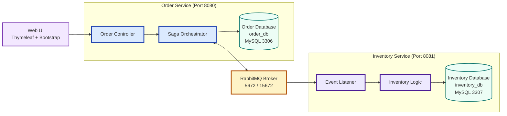
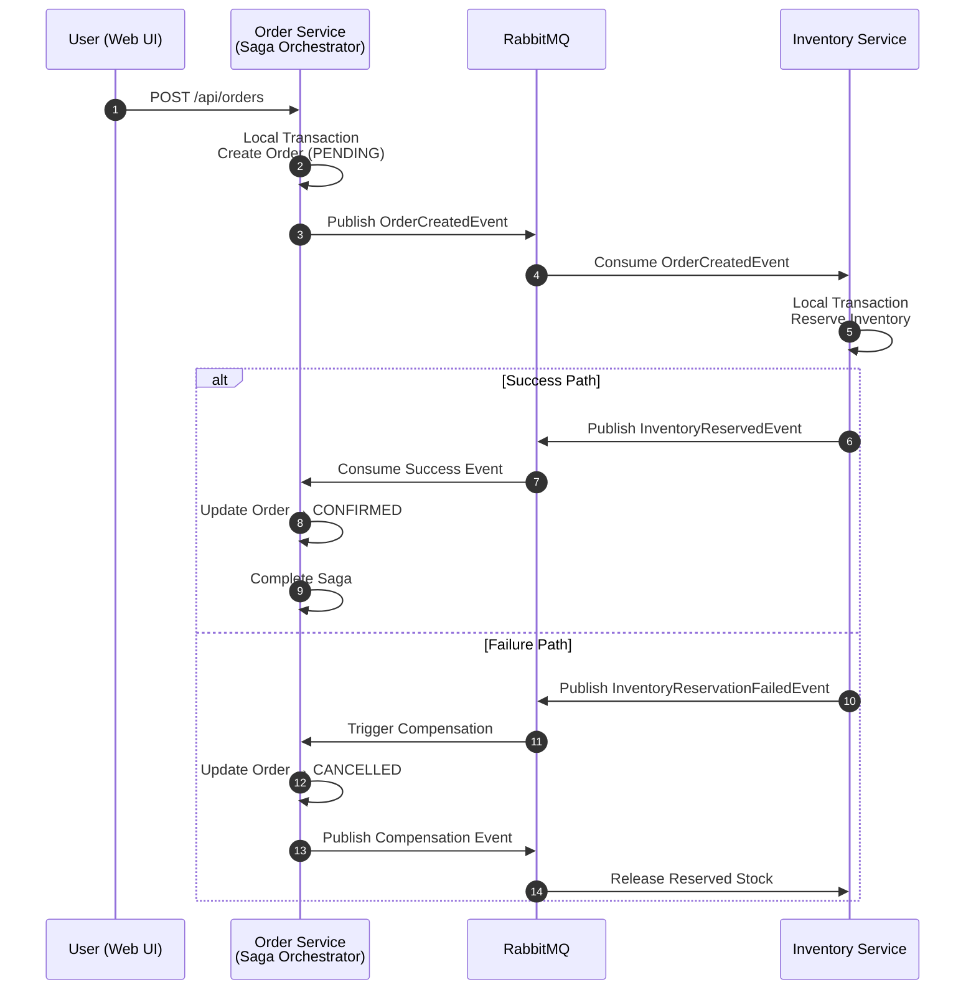
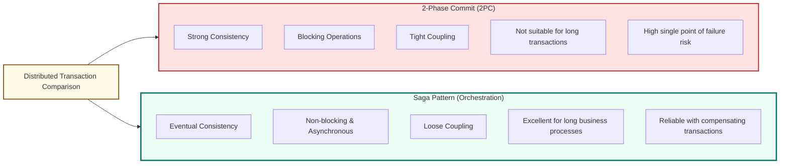

# SOFTWARE REQUIREMENTS SPECIFICATION (SRS)

**E-commerce Checkout System with Saga Pattern for Eventual Consistency**

**Project Type:** Application-Based (Distributed Systems + Data Warehouse Relevance)  
**Target Presentation Date:** March 31, 2026  
**Final Demo Date:** April 7, 2026  
**Final Report Deadline:** April 15, 2026

---

## 1. Project Overview & Purpose

Develop a microservices-based e-commerce checkout system that demonstrates **Eventual Consistency** using the **Orchestration-Based Saga Pattern**.

**Business Scenario (E-commerce)**:  
A customer places an order for products (e.g., iPhone, laptop). The system must:

- Create an order immediately
- Reserve inventory asynchronously
- Confirm or cancel the order
- Handle failures gracefully with compensating transactions

**Core Objective**: Show **temporary inconsistency** (order created but inventory not yet updated) → **automatic eventual consistency** (or rollback), which is critical for high-availability data warehouses handling big data.

---

## 2. Functional Requirements

### 2.1 Core Features (MVP – Must be completed by March 31)

**FR-01: Place Order**

- User submits order via web UI
- Order Service creates order with status = `PENDING` (local ACID transaction)
- Returns order ID immediately

**FR-02: Saga Orchestration (Order Service)**

- Publish `OrderCreatedEvent` to RabbitMQ
- Listen for `InventoryReservedEvent`
- On success → update order to `CONFIRMED`
- On failure → trigger compensation (cancel order)

**FR-03: Inventory Reservation (Inventory Service)**

- Listen for `OrderCreatedEvent`
- Check stock, reserve quantity (local ACID transaction)
- Publish `InventoryReservedEvent` (success) or `InventoryReservationFailedEvent` (failure)
- On compensation: release reserved inventory

**FR-04: Compensation / Rollback**

- Full saga compensation logic for every failure point
- Example: Inventory fails → Order Service cancels the order and logs it

**FR-05: Visual Demonstration Dashboard**

- Real-time view of:
  - Order status (Order DB)
  - Inventory levels (Inventory DB)
  - Saga log
- Button to “Simulate Failure” (e.g., temporarily stop Inventory Service)

**FR-06: Logging & Monitoring**

- Every saga step logged in `saga_log` table
- RabbitMQ management UI accessible

### 2.2 Extended Features (Nice-to-have for April 7 Demo)

- Simple OLAP query: “Total sales this week”
- Association rule mining on completed orders
- LLM integration (LangChain4j): Analyze saga logs and suggest consistency level

---

## 3. Non-Functional Requirements

- **Performance**: Order placement < 500ms, eventual consistency within 5 seconds
- **Scalability**: Support 100+ concurrent orders
- **Reliability**: 100% compensation success rate in failure scenarios
- **Usability**: Clean, responsive web UI (Thymeleaf + Bootstrap)
- **Deployability**: One-command startup with `docker compose up --build`
- **Code Quality**: Clean architecture, detailed comments, proper exception handling

---

## 4. System Architecture

- **Pattern**: Orchestration-Based Saga (Order Service = Saga Orchestrator)
- **Microservices**:
  - Order Service (Port 8080)
  - Inventory Service (Port 8081)
- **Communication**: RabbitMQ (AMQP) – Event-Driven
- **Database**: Database-per-Service (2 separate MySQL instances)
- **Containerization**: Docker + Docker Compose

**Required Diagrams**:

1. Orchestration-Based Saga Flow
2. 2PC vs Saga Comparison
3. Microservices + RabbitMQ Architecture

**System Architecture - Microservices with RabbitMQ**



**Orchestration-Based Saga Flow**



**2PC vs Saga Pattern Comparison**



---

## 5. Detailed Database Schema (MySQL)

### Order Database (`order_db`)

```sql
CREATE DATABASE order_db CHARACTER SET utf8mb4;
USE order_db;

CREATE TABLE orders (
    id BIGINT AUTO_INCREMENT PRIMARY KEY,
    order_id VARCHAR(36) UNIQUE NOT NULL,
    user_id BIGINT NOT NULL,
    total_amount DECIMAL(10,2) NOT NULL,
    status ENUM('PENDING', 'CONFIRMED', 'CANCELLED', 'FAILED') DEFAULT 'PENDING',
    saga_id VARCHAR(36),
    created_at TIMESTAMP DEFAULT CURRENT_TIMESTAMP
);

CREATE TABLE saga_log (
    saga_id VARCHAR(36) PRIMARY KEY,
    current_step VARCHAR(50),
    status ENUM('STARTED','COMPLETED','COMPENSATED','FAILED'),
    last_updated TIMESTAMP DEFAULT CURRENT_TIMESTAMP ON UPDATE CURRENT_TIMESTAMP
);
```

### Inventory Database (inventory_db):

```sql
CREATE DATABASE inventory_db;
USE inventory_db;

CREATE TABLE inventory (
    product_id BIGINT PRIMARY KEY,
    product_name VARCHAR(100),
    stock INT DEFAULT 1000,
    reserved INT DEFAULT 0
);

CREATE TABLE inventory_log (
    id BIGINT AUTO_INCREMENT PRIMARY KEY,
    order_id VARCHAR(36),
    product_id BIGINT,
    quantity INT,
    action ENUM('RESERVE','RELEASE'),
    timestamp TIMESTAMP DEFAULT CURRENT_TIMESTAMP
);
```

**Initial Data**:

- product_id=1, name='iPhone 16', stock=1000
- product_id=2, name='MacBook Pro', stock=500

---

## 6. RabbitMQ Event Definitions

**OrderCreatedEvent**

```json
{
  "sagaId": "uuid-string",
  "orderId": "ORD-123456",
  "userId": 1001,
  "items": [
    { "productId": 1, "quantity": 2 },
    { "productId": 2, "quantity": 1 }
  ],
  "totalAmount": 2997.0
}
```

**InventoryReservedEvent**

```json
{
  "sagaId": "uuid-string",
  "orderId": "ORD-123456",
  "success": true,
  "reservedItems": [{ "productId": 1, "quantity": 2 }]
}
```

**InventoryReservationFailedEvent**

```json
{
  "sagaId": "uuid-string",
  "orderId": "ORD-123456",
  "success": false,
  "reason": "Insufficient stock"
}
```

---

## 7. API Endpoints (Order Service) – With Examples

- `POST /api/orders`

**Request Body:**

```json
{
  "userId": 1001,
  "items": [{ "productId": 1, "quantity": 2 }]
}
```

**Response:**

```json
{
  "orderId": "ORD-123456",
  "status": "PENDING"
}
```

- `GET /api/orders/{orderId}`
  Returns current order status and saga progress
- `GET /api/dashboard`
  Real-time demo page (auto-refresh every 2 seconds)

---

## 8. Saga Step-by-Step Logic (Critical – Detailed)

**Happy Path**

1. Order Service → local transaction: create order with status `PENDING`
2. Publish `OrderCreatedEvent` to RabbitMQ
3. Inventory Service → local transaction: reserve stock (`reserved += quantity`)
4. Publish `InventoryReservedEvent`
5. Order Service → update order status to `CONFIRMED` and complete saga

**Compensation Path** (must be fully implemented)

- Any failure (e.g. insufficient stock) → Order Service triggers compensation:
  - Update order status to `CANCELLED`
  - Publish compensation event
- Inventory Service receives compensation → release reserved stock (`reserved -= quantity`)
- All steps must be logged in `saga_log` table

---

## 9. Docker Compose Requirements (Full Sample)

```YMAL
version: '3.8'
services:
  rabbitmq:
    image: rabbitmq:3.13-management
    ports:
      - "5672:5672"
      - "15672:15672"
  order-db:
    image: mysql:8.0
    environment:
      MYSQL_ROOT_PASSWORD: root
      MYSQL_DATABASE: order_db
    ports:
      - "3306:3306"
  inventory-db:
    image: mysql:8.0
    environment:
      MYSQL_ROOT_PASSWORD: root
      MYSQL_DATABASE: inventory_db
    ports:
      - "3307:3306"
  order-service:
    build: ./order-service
    ports:
      - "8080:8080"
    depends_on:
      - order-db
      - rabbitmq
  inventory-service:
    build: ./inventory-service
    ports:
      - "8081:8081"
    depends_on:
      - inventory-db
      - rabbitmq
```

---

## 10. Technology Stack (Exact Versions)

- Java 17
- Spring Boot 3.3.4
- Spring AMQP (RabbitMQ)
- Spring Data JPA + Hibernate
- MySQL 8.0
- Lombok
- Thymeleaf + Bootstrap 5 (for dashboard)
- Docker + Docker Compose
